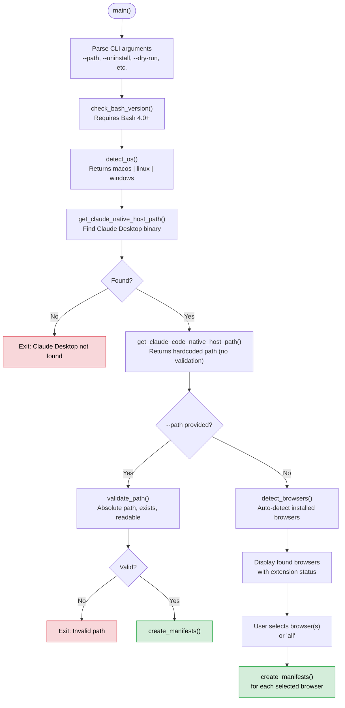
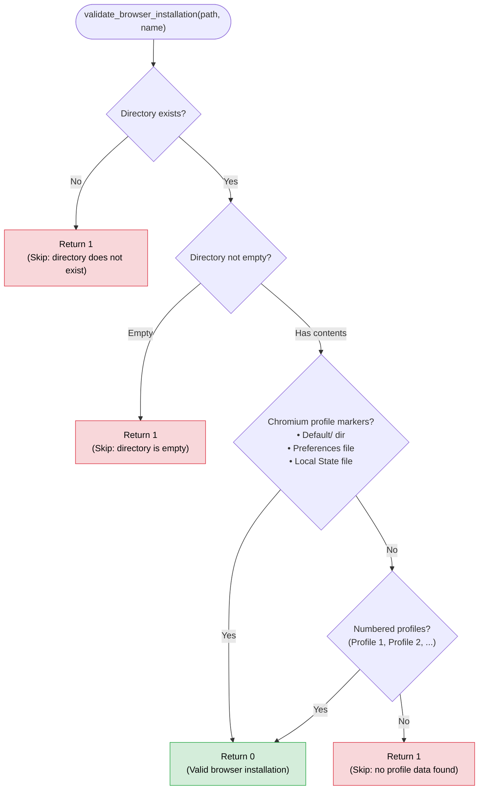
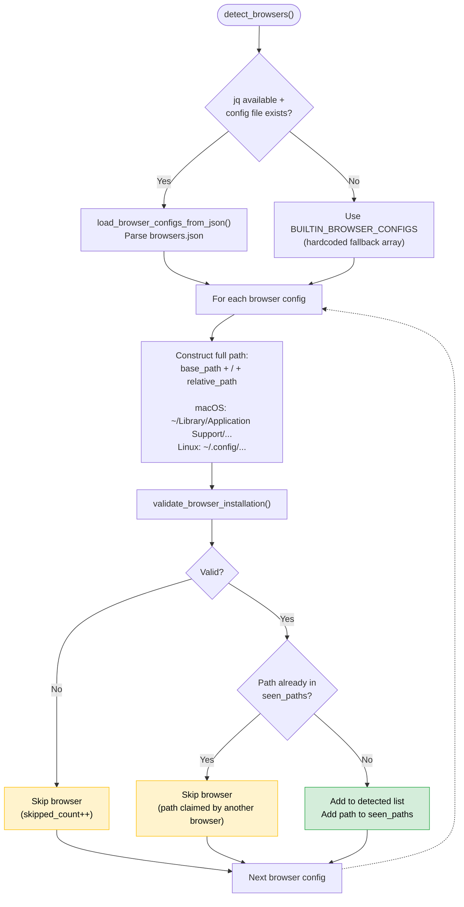
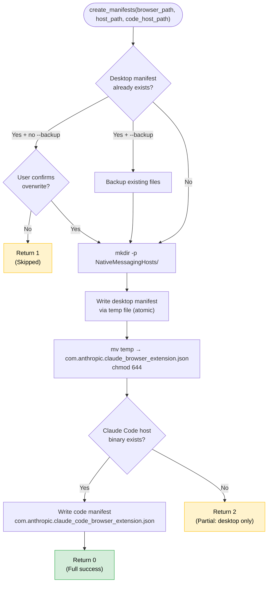

# Browser Detection Analysis

Analysis of the browser detection logic in **claude-chromium-native-messaging**.

Last updated: 2026-03-09

---

## 1. Current Detection Flow

The browser detection follows a linear pipeline from script entry to manifest creation:



### Detailed Function Call Chain

```
main() [setup.sh:748]
  |
  +-- Parse CLI arguments [setup.sh:750-799]
  |     Captures --path, --uninstall, --dry-run, --verbose, --debug, etc.
  |
  +-- check_bash_version() [setup.sh:114-125]
  |     Requires Bash 4.0+
  |
  +-- detect_os() [setup.sh:179-186]
  |     Returns "macos", "linux", or "windows" based on uname -s
  |
  +-- get_claude_native_host_path() [setup.sh:202-228]
  |     Finds Claude Desktop native host binary (required)
  |     Checks 5 Linux paths, 1 macOS path with [[ -f "$path" ]]
  |     Returns empty string if not found → main() exits
  |
  +-- get_claude_code_native_host_path() [setup.sh:230-232]
  |     Returns $HOME/.claude/chrome/chrome-native-host
  |     ** No existence validation - just returns a hardcoded path **
  |     Existence checked later at main() [setup.sh:840] and create_manifests() [setup.sh:579]
  |
  +-- IF --path provided: Custom path flow [setup.sh:849-874]
  |     validate_path() -> existence check -> create_manifests()
  |
  +-- ELSE: Auto-detection flow [setup.sh:876-964]
        |
        +-- detect_browsers() [setup.sh:342-437]
        |     1. Try JSON config via load_browser_configs_from_json()
        |     2. Fall back to BUILTIN_BROWSER_CONFIGS array
        |     3. For each config: build path, validate with validate_browser_installation()
        |     4. Deduplicate paths (first browser claiming a path wins)
        |     5. Return detected browsers as "Name|Path" lines
        |
        +-- Display found browsers with extension status [setup.sh:892-910]
        +-- Prompt user selection [setup.sh:913-928]
        +-- create_manifests() for each selected browser [setup.sh:933-964]
```

---

## 2. Browser Detection Detail

### Config Loading: `load_browser_configs_from_json()` [setup.sh:274-299]

```
1. Check config file exists [setup.sh:275-277]
2. Check jq is installed [setup.sh:280-282]
3. Map OS to key ("macos" or "linux") [setup.sh:284-291]
4. Parse with jq: select browsers where .paths[$os] != null [setup.sh:294-298]
5. Output as "Name|RelativePath" pipe-delimited lines
```

### Browser Validation: `validate_browser_installation()` [setup.sh:301-340]

This function validates that a detected directory is actually a Chromium browser data directory, not just an empty or leftover folder.



### Path Construction & Deduplication in `detect_browsers()` [setup.sh:342-437]



**Path deduplication** prevents duplicate manifest creation when multiple browsers share the same data directory. For example, on macOS, Chromium, SRWare Iron, and Ungoogled Chromium all use `~/Library/Application Support/Chromium` — only the first one in the config list is shown to the user.

---

## 3. Currently Supported Browsers

31 browsers are configured in `config/browsers.json` (lines 49-300). An identical fallback list exists in `BUILTIN_BROWSER_CONFIGS` (setup.sh lines 240-272, setup.ps1 lines 190-219).

| # | Browser | macOS Path | Linux Path | Windows Path |
|---|---------|-----------|------------|-------------|
| 1 | Brave | BraveSoftware/Brave-Browser | BraveSoftware/Brave-Browser | BraveSoftware\Brave-Browser\User Data |
| 2 | Arc | Arc/User Data | — | — |
| 3 | Vivaldi | Vivaldi | vivaldi | Vivaldi\User Data |
| 4 | Microsoft Edge | Microsoft Edge | microsoft-edge | Microsoft\Edge\User Data |
| 5 | Chromium | Chromium | chromium | Chromium\User Data |
| 6 | Google Chrome | Google/Chrome | google-chrome | Google\Chrome\User Data |
| 7 | Google Chrome Canary | Google/Chrome Canary | google-chrome-unstable | Google\Chrome SxS\User Data |
| 8 | Google Chrome Beta | Google/Chrome Beta | google-chrome-beta | Google\Chrome Beta\User Data |
| 9 | Google Chrome Dev | Google/Chrome Dev | google-chrome-unstable | Google\Chrome Dev\User Data |
| 10 | Genspark | GensparkSoftware/Genspark-Browser | GensparkSoftware/Genspark-Browser | GensparkSoftware\Genspark-Browser\User Data |
| 11 | Opera | com.operasoftware.Opera | opera | Opera Software\Opera Stable |
| 12 | Opera GX | com.operasoftware.OperaGX | opera-gx | Opera Software\Opera GX Stable |
| 13 | Sidekick | Sidekick | Sidekick | Sidekick\User Data |
| 14 | Orion | Orion | Orion | — |
| 15 | Yandex | Yandex/YandexBrowser | yandex-browser | Yandex\YandexBrowser\User Data |
| 16 | Naver Whale | Naver/Whale | naver-whale | Naver\Whale\User Data |
| 17 | Coc Coc | CocCoc/Browser | coccoc | CocCoc\Browser\User Data |
| 18 | Comodo Dragon | Comodo/Dragon | comodo-dragon | Comodo\Dragon\User Data |
| 19 | Avast Secure Browser | AVAST Software/Browser | avast-secure-browser | AVAST Software\Browser\User Data |
| 20 | AVG Secure Browser | AVG/Browser | avg-secure-browser | AVG\Browser\User Data |
| 21 | Epic Privacy Browser | Epic Privacy Browser | epic | Epic Privacy Browser\User Data |
| 22 | Torch | Torch | torch | Torch\User Data |
| 23 | Slimjet | Slimjet | slimjet | Slimjet\User Data |
| 24 | SRWare Iron | Chromium | iron | Chromium\User Data |
| 25 | Ungoogled Chromium | Chromium | ungoogled-chromium | Chromium\User Data |
| 26 | Helium | net.imput.helium | net.imput.helium | imput\Helium\User Data |
| 27 | Cent Browser | CentBrowser | cent-browser | CentBrowser\User Data |
| 28 | Maxthon | Maxthon | maxthon | Maxthon\User Data |
| 29 | Iridium | Iridium | iridium-browser | Iridium\User Data |
| 30 | Falkon | falkon | falkon | — |
| 31 | Colibri | Nickolabs/Colibri | colibri | — |

### Shared Data Directory Conflicts

| macOS Path | Browsers Sharing It | Resolution |
|-----------|-------------------|------------|
| `Chromium` | Chromium, SRWare Iron, Ungoogled Chromium | First in config wins (Chromium) |
| `google-chrome-unstable` (Linux) | Chrome Canary, Chrome Dev | First in config wins (Chrome Canary) |
| `Chromium\User Data` (Windows) | Chromium, SRWare Iron, Ungoogled Chromium | First in config wins (Chromium) |

---

## 4. Path Validation Logic

### `validate_path()` [setup.sh:138-173]

Used only for `--path` custom browser paths, not for auto-detected browsers.

```bash
validate_path(path):
  1. Check path is absolute (starts with /)
     -> Fail if relative path

  2. resolved_path = realpath -m "$path"    # Resolve symlinks, normalize
     -> Fail if realpath returns error

  3. Security: reject path traversal (.. in original + path changed after resolve)

  4. Check resolved path exists as a directory
     -> Fail if not a directory

  5. Check directory is readable
     -> Fail if not readable

  6. Return resolved path
```

**Note:** The Bash version no longer enforces a directory whitelist. The PowerShell version (`Test-ValidPath` in setup.ps1:107-140) still restricts paths to `%LOCALAPPDATA%`, `%USERPROFILE%`, `%PROGRAMFILES%`, `%PROGRAMFILES(X86)%`, and `%TEMP%`.

### Claude Desktop Host Validation [setup.sh:202-228]

```bash
get_claude_native_host_path():
  - Checks each candidate path with [[ -f "$path" ]]
  - Returns first existing path
  - Returns empty string if none found
  -> main() exits if empty [setup.sh:831-835]
```

### Claude Code Host Validation [setup.sh:230-232]

```bash
get_claude_code_native_host_path():
  - Returns hardcoded path: $HOME/.claude/chrome/chrome-native-host
  - NO existence check in this function
  - Existence checked later in main() [setup.sh:840] and create_manifests() [setup.sh:579]
  - Manifest only created if file exists at that point
```

### Windows MSIX Detection [setup.ps1:146-179]

The PowerShell script includes additional fallback detection for Windows Store / MSIX installations:

```
Get-ClaudeNativeHostPath:
  1. Check standard paths (%APPDATA%, %LOCALAPPDATA%, %PROGRAMFILES%)
  2. Fallback: Scan %LOCALAPPDATA%\Packages\Claude_* for MSIX installation
  3. Look for chrome-native-host.exe in LocalCache\Roaming\Claude\ChromeNativeHost\
  4. Return first found, or $null
```

---

## 5. Manifest Creation



### Manifest Content

**Desktop manifest** (`com.anthropic.claude_browser_extension.json`):
```json
{
  "name": "com.anthropic.claude_browser_extension",
  "description": "Claude Browser Extension Native Host",
  "path": "/path/to/chrome-native-host",
  "type": "stdio",
  "allowed_origins": [
    "chrome-extension://fcoeoabgfenejglbffodgkkbkcdhcgfn/",
    "chrome-extension://dihbgbndebgnbjfmelmegjepbnkhlgni/",
    "chrome-extension://dngcpimnedloihjnnfngkgjoidhnaolf/"
  ]
}
```

**Code manifest** (`com.anthropic.claude_code_browser_extension.json`):
```json
{
  "name": "com.anthropic.claude_code_browser_extension",
  "description": "Claude Code Browser Extension Native Host",
  "path": "/path/to/chrome-native-host",
  "type": "stdio",
  "allowed_origins": [
    "chrome-extension://fcoeoabgfenejglbffodgkkbkcdhcgfn/"
  ]
}
```

The desktop manifest allows all three extension variants (official, dev, staging). The code manifest only allows the official extension.

---

## 6. Open Issues

### Issue 1: `get_claude_code_native_host_path()` Returns Unchecked Path

**Status:** Open
**Severity:** Low (functionally safe but inconsistent API)

**Root Cause**: The function (setup.sh:230-232) returns a hardcoded path without checking if the file exists.

```bash
get_claude_code_native_host_path() {
    echo "$HOME/.claude/chrome/chrome-native-host"
}
```

Compare with `get_claude_native_host_path()` (setup.sh:202-228), which explicitly checks `[[ -f "$path" ]]` before returning each candidate path.

**Impact**: The code is functionally safe — callers always verify the path exists before using it (main() at line 840, create_manifests() at line 579). But the function API is misleading: callers must know to verify the return value, unlike the Desktop host function which guarantees a valid path or empty string.

**Recommended fix**:
```bash
get_claude_code_native_host_path() {
    local path="$HOME/.claude/chrome/chrome-native-host"
    if [[ -f "$path" ]]; then
        echo "$path"
    else
        echo ""
    fi
}
```

### Issue 2: PowerShell Path Validation Whitelist

**Status:** Open (Bash version fixed, PowerShell still restricted)
**Severity:** Low

The PowerShell `Test-ValidPath` function (setup.ps1:107-140) restricts custom paths to:
- `%LOCALAPPDATA%`
- `%USERPROFILE%`
- `%PROGRAMFILES%` / `%PROGRAMFILES(X86)%`
- `%TEMP%`

This covers most real-world installations but would reject browsers installed on a separate drive (e.g., `D:\Apps\Brave\User Data`).

The Bash `validate_path()` was simplified and no longer has this restriction — it only validates the path is absolute, exists, and is readable.

### Issue 3: Config Drift Risk (JSON vs Built-in)

**Status:** Open
**Severity:** Low

`BUILTIN_BROWSER_CONFIGS` in setup.sh (lines 240-272) and setup.ps1 (lines 190-219) must be manually kept in sync with `config/browsers.json`. There is no CI check or generation script to prevent drift.

Currently both configs are in sync (31 browsers in JSON, 31 in Bash fallback, 28 in PowerShell fallback — the 3 missing in PowerShell are Orion, Falkon, and Colibri which have `null` Windows paths).

---

## 7. Resolved Issues

### ~~Chrome Canary / Beta / Dev Not Supported~~

**Status:** Resolved

Chrome Canary, Chrome Beta, and Chrome Dev have been added to both `config/browsers.json` and `BUILTIN_BROWSER_CONFIGS` in setup.sh and setup.ps1.

### ~~Custom Paths Rejected by Security Whitelist (Bash)~~

**Status:** Resolved

The Bash `validate_path()` function no longer enforces a directory whitelist. It now validates: absolute path, realpath resolution, no path traversal, directory exists, and directory is readable.

### ~~No Browser Data Validation~~

**Status:** Resolved

The new `validate_browser_installation()` function (setup.sh:301-340, setup.ps1:249-280) validates browser directories beyond a simple existence check. It verifies:
1. Directory exists
2. Directory is not empty
3. Contains Chromium profile markers (`Default/`, `Preferences`, `Local State`, or numbered profiles)

### ~~Shared Data Directory Collisions~~

**Status:** Resolved

Path deduplication was added to `detect_browsers()` via a `seen_paths` array. The first browser in the config to claim a path wins; subsequent browsers sharing the same path are skipped with a verbose message.

---

## 8. Key File Locations Reference

| Component | File | Lines |
|-----------|------|-------|
| Browser JSON config | `config/browsers.json` | 49-300 |
| Built-in browser fallback (Bash) | `setup.sh` → `BUILTIN_BROWSER_CONFIGS` | 240-272 |
| Built-in browser fallback (PS) | `setup.ps1` → `$BUILTIN_BROWSER_CONFIGS` | 190-219 |
| Path validation (Bash) | `setup.sh` → `validate_path()` | 138-173 |
| Path validation (PS) | `setup.ps1` → `Test-ValidPath()` | 107-140 |
| OS detection | `setup.sh` → `detect_os()` | 179-186 |
| Base path resolution | `setup.sh` → `get_app_support_base()` | 188-196 |
| Desktop host detection (Bash) | `setup.sh` → `get_claude_native_host_path()` | 202-228 |
| Desktop host detection (PS) | `setup.ps1` → `Get-ClaudeNativeHostPath()` | 146-179 |
| Code host detection (Bash) | `setup.sh` → `get_claude_code_native_host_path()` | 230-232 |
| Code host detection (PS) | `setup.ps1` → `Get-ClaudeCodeNativeHostPath()` | 181-183 |
| Browser installation validation (Bash) | `setup.sh` → `validate_browser_installation()` | 301-340 |
| Browser installation validation (PS) | `setup.ps1` → `Test-BrowserInstallation()` | 249-280 |
| JSON config loader (Bash) | `setup.sh` → `load_browser_configs_from_json()` | 274-299 |
| JSON config loader (PS) | `setup.ps1` → `Get-BrowserConfigsFromJson()` | 221-247 |
| Browser auto-detection (Bash) | `setup.sh` → `detect_browsers()` | 342-437 |
| Browser auto-detection (PS) | `setup.ps1` → `Get-InstalledBrowsers()` | 282-315 |
| Extension check (Bash) | `setup.sh` → `check_extension_installed()` | 443-461 |
| Extension check (PS) | `setup.ps1` → `Test-ExtensionInstalled()` | 321-339 |
| Manifest creation (Bash) | `setup.sh` → `create_manifests()` | 494-610 |
| Manifest creation (PS) | `setup.ps1` → `New-ManifestFiles()` | 375-483 |
| Custom path handling (Bash) | `setup.sh` → `main()` | 849-874 |
| Auto-detect flow (Bash) | `setup.sh` → `main()` | 876-964 |

---

## 9. Architecture Notes

### Design Decisions
- **Dual config strategy**: JSON config with jq for flexibility, hardcoded fallback for portability. Good for environments without jq, but creates maintenance burden (two lists to keep in sync per platform).
- **Directory-based detection**: Browsers are detected by the existence of their user data directory, not by checking for executables. This works well since the tool creates native messaging manifests inside these directories.
- **Profile marker validation**: `validate_browser_installation()` goes beyond directory existence — it checks for Chromium-specific markers (`Default/`, `Preferences`, `Local State`, numbered profiles) to avoid false positives from leftover or unrelated directories.
- **Path deduplication**: When multiple browsers share the same data directory (e.g., Chromium/SRWare Iron/Ungoogled Chromium on macOS), the first browser in config order wins. This prevents duplicate manifest creation and confusing UI.
- **Atomic manifest writes**: Manifests are written to a temp file first, then moved into place, preventing corrupt manifests from partial writes.
- **Windows MSIX support**: The PowerShell script includes fallback detection for Windows Store / MSIX Claude installations, scanning `%LOCALAPPDATA%\Packages\Claude_*` directories.

### Cross-Platform Parity

| Feature | Bash (macOS/Linux) | PowerShell (Windows) |
|---------|-------------------|---------------------|
| JSON config loading | Yes (requires jq) | Yes (native ConvertFrom-Json) |
| Built-in fallback | 31 browsers | 28 browsers (no Orion/Falkon/Colibri) |
| Browser validation | validate_browser_installation() | Test-BrowserInstallation() |
| Path deduplication | seen_paths array | seenPaths array |
| Custom path validation | Absolute + exists + readable | Whitelist + exists |
| MSIX/Store detection | N/A | Yes (Claude_* package scan) |
| Atomic manifest writes | Yes (mktemp + mv) | No (direct Set-Content) |
| Debug mode (`--debug`) | Yes | No |

### Potential Improvements
1. **Config drift CI check**: Add a CI step to verify `BUILTIN_BROWSER_CONFIGS` matches `browsers.json` content, preventing silent drift between the two sources.
2. **PowerShell path validation parity**: Remove the directory whitelist from `Test-ValidPath` to match the Bash behavior (validate existence and readability, not location).
3. **PowerShell atomic writes**: Use temp file + Move-Item instead of direct `Set-Content` for manifest creation, matching the Bash script's safer approach.
4. **Chrome Canary / Chrome Dev Linux collision**: Both map to `google-chrome-unstable` on Linux. The deduplication handles this correctly (Chrome Canary wins) but users with Chrome Dev installed won't see it listed if Chrome Canary is also present.
