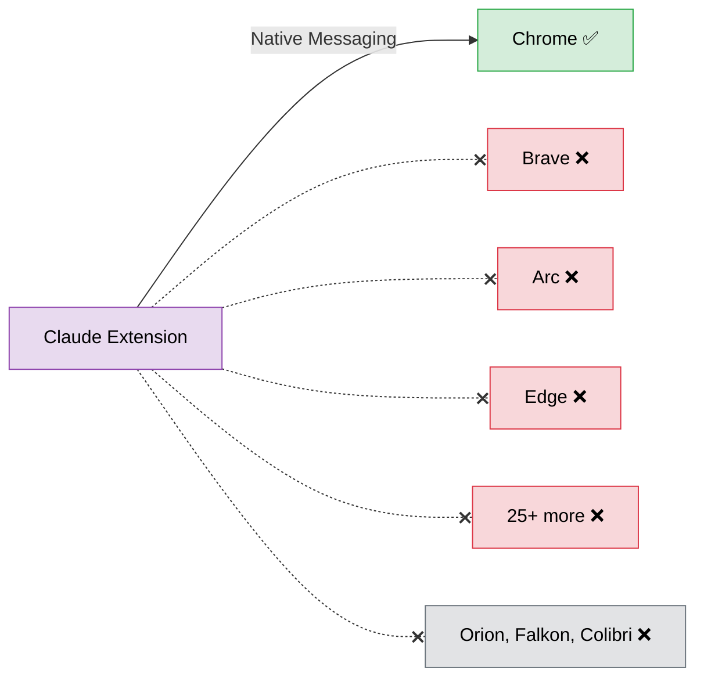
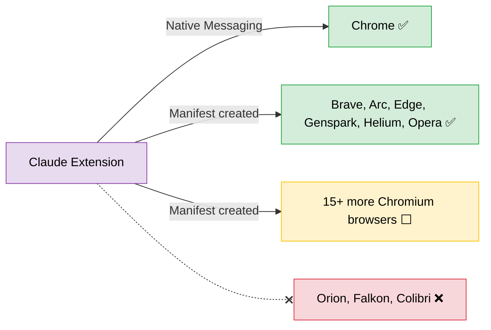
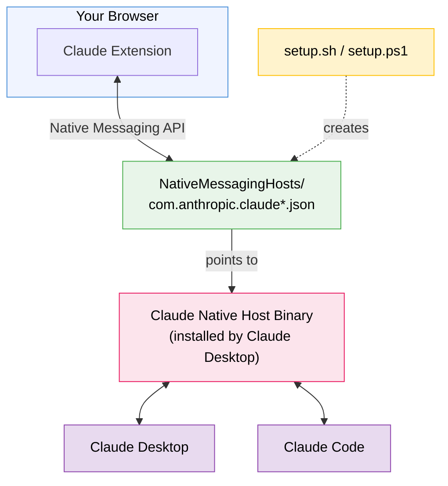
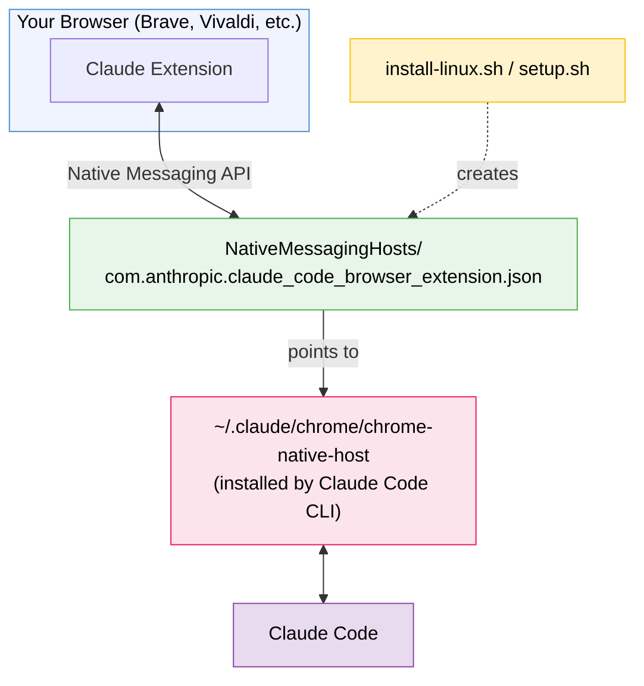

# Claude Native Messaging for Chromium Browsers

[](https://github.com/stolot0mt0m/claude-chromium-native-messaging/stargazers)
[](https://github.com/stolot0mt0m/claude-chromium-native-messaging/network)
[](https://opensource.org/licenses/MIT)
[](http://makeapullrequest.com)
[](https://www.apple.com/macos/)
[](https://www.linux.org/)
[](https://www.microsoft.com/windows)
[](#supported-browsers)

> **Use Claude AI browser extension with Brave, Arc, Vivaldi, Edge, Opera, Genspark, Helium, and other Chromium-based browsers**

Enable [Claude in Chrome](https://claude.ai/download) extension to work with alternative Chromium-based browsers. Connect Claude Desktop and Claude Code to your favorite browser!

## Quick Start

**macOS / Linux:**
```bash
git clone https://github.com/stolot0mt0m/claude-chromium-native-messaging.git
cd claude-chromium-native-messaging
./setup.sh
```

**Windows (PowerShell):**
```powershell
git clone https://github.com/stolot0mt0m/claude-chromium-native-messaging.git
cd claude-chromium-native-messaging
.\setup.ps1
```

## Linux Installation

On Linux, **Claude Code CLI** provides the native messaging host. This tool extends Claude Code's browser support to additional Chromium browsers that Claude Code doesn't configure automatically.

### Prerequisites

- **[Claude Code CLI](https://docs.anthropic.com/en/docs/claude-code)** installed and set up
- **Chrome, Chromium, Brave, or other Chromium browser** installed

### Option 1: Quick Setup (Recommended)

```bash
git clone https://github.com/stolot0mt0m/claude-chromium-native-messaging.git
cd claude-chromium-native-messaging
./install-linux.sh
```

This script:
1. Verifies Claude Code CLI is installed and its native host exists
2. Detects which alternative Chromium browsers are installed
3. Copies the native messaging manifest to each browser's directory

### Option 2: Interactive Setup

```bash
./setup.sh
```

The interactive setup lets you select specific browsers and provides more control.

### How It Works on Linux

Claude Code CLI installs its native messaging host at `~/.claude/chrome/chrome-native-host` and registers it for Google Chrome and Microsoft Edge. This tool copies that registration to additional browsers:

```
Claude Code CLI
    └── installs native host at ~/.claude/chrome/chrome-native-host
    └── registers for: Chrome, Edge (automatic)

This tool
    └── registers for: Brave, Vivaldi, Chromium, Opera, 25+ more browsers
```

### After Installation

1. **Completely quit your browser** (check `ps aux | grep chrome` to verify no processes remain)
2. **Restart the browser**
3. **Install the Claude extension** if not already installed: [Chrome Web Store](https://chrome.google.com/webstore/detail/claude/fcoeoabgfenejglbffodgkkbkcdhcgfn)
4. **Open Claude in the side panel** — it should now connect via Claude Code

### More Help

See [`docs/linux-setup.md`](docs/linux-setup.md) for detailed instructions and troubleshooting.

---

## Features

- **27+ Supported Browsers** - Brave, Arc, Vivaldi, Edge, Opera, and more
- **Cross-Platform** - Works on macOS, Linux, and Windows
- **Safe by Default** - Dry-run mode, backup support, and path validation
- **Interactive Setup** - Select which browsers to configure
- **JSON Configuration** - Easy to extend with new browsers
- **Test Suite** - Automated tests for reliability

## The Problem

Claude's official browser extension only supports Google Chrome. But many developers prefer browsers like **Brave**, **Arc**, **Vivaldi**, or **Microsoft Edge**.

The extension actually works fine in these browsers — it's just the **Native Messaging Host** configuration that's missing. Without it:

- Claude Desktop can't connect to the browser extension
- Claude Code's `/chrome` command doesn't detect the extension
- No browser automation capabilities



## The Solution

This tool automatically configures Native Messaging Host for your Chromium browser, enabling:

- Full Claude Desktop integration (macOS/Windows)
- Full Claude Code integration (all platforms)
- Claude Code browser automation (`/chrome`)
- Side panel functionality
- All Claude in Chrome features



## Supported Browsers

All browsers listed below are **Chromium-based** and support the Chrome Extensions API including Native Messaging. The setup script auto-detects installed browsers and configures the necessary manifest files.

### Confirmed Working

These browsers have been tested and confirmed working by users or maintainers:

| Browser | Engine | macOS | Linux | Windows | Notes |
|---------|--------|:-----:|:-----:|:-------:|-------|
| **Google Chrome** | Chromium | ✅ | ✅ | ✅ | Official target |
| **Google Chrome Canary** | Chromium | ✅ | ✅ | ✅ | Dev channel ([#3](https://github.com/stolot0mt0m/claude-chromium-native-messaging/issues/3)) |
| **Google Chrome Beta** | Chromium | ✅ | ✅ | ✅ | |
| **Google Chrome Dev** | Chromium | ✅ | ✅ | ✅ | |
| **Chromium** | Chromium | ✅ | ✅ | ✅ | Base project |
| **Microsoft Edge** | Chromium | ✅ | ✅ | ✅ | |
| **Brave** | Chromium | ✅ | ✅ | ✅ | |
| **Arc** | Chromium | ✅ | — | ✅ | [#11](https://github.com/stolot0mt0m/claude-chromium-native-messaging/issues/11) |
| **Opera / Opera GX** | Chromium | ✅ | ✅ | ✅ | |
| **Helium** | Chromium | ✅ | ✅ | ✅ | [#2](https://github.com/stolot0mt0m/claude-chromium-native-messaging/issues/2) |
| **Genspark** | Chromium | ✅ | — | ✅ | Confirmed by maintainer |

### Should Work (Chromium-based, not yet confirmed)

These are genuine Chromium/Blink-based browsers with full Chrome extension support. They **should work** based on their architecture, but haven't been explicitly confirmed by users yet. If you use any of these browsers, please [open an issue](https://github.com/stolot0mt0m/claude-chromium-native-messaging/issues/new) to let us know if it works!

| Browser | Engine | macOS | Linux | Windows |
|---------|--------|:-----:|:-----:|:-------:|
| **Vivaldi** | Chromium | ⬜ | ⬜ | ⬜ |
| **Ungoogled Chromium** | Chromium | ⬜ | ⬜ | ⬜ |
| **Yandex Browser** | Chromium | ⬜ | ⬜ | ⬜ |
| **Naver Whale** | Chromium | ⬜ | ⬜ | ⬜ |
| **Coc Coc** | Chromium | ⬜ | ⬜ | ⬜ |
| **Comodo Dragon** | Chromium | ⬜ | ⬜ | ⬜ |
| **Avast Secure Browser** | Chromium | ⬜ | ⬜ | ⬜ |
| **AVG Secure Browser** | Chromium | ⬜ | ⬜ | ⬜ |
| **Epic Privacy Browser** | Chromium | ⬜ | ⬜ | ⬜ |
| **SRWare Iron** | Chromium | ⬜ | ⬜ | ⬜ |
| **Slimjet** | Chromium | ⬜ | ⬜ | ⬜ |
| **Cent Browser** | Chromium | ⬜ | ⬜ | ⬜ |
| **Maxthon** | Chromium | ⬜ | ⬜ | ⬜ |
| **Iridium** | Chromium | ⬜ | ⬜ | ⬜ |
| **Sidekick** | Chromium | ⬜ | ⬜ | ⬜ |

> **Help us verify!** If you successfully use this tool with any of the browsers above, please [report it](https://github.com/stolot0mt0m/claude-chromium-native-messaging/issues/new?title=Browser+confirmed+working:+BROWSER_NAME&body=Browser:%20%0AOS:%20%0AVersion:%20%0A%0ASetup%20completed%20successfully%20and%20Claude%20extension%20connects%20via%20native%20messaging.) so we can move it to the confirmed list.

### Not Compatible

| Browser | Engine | Why |
|---------|--------|-----|
| **Orion** (Kagi) | WebKit | Not Chromium-based. Supports Chrome extensions via compatibility layer, but Native Messaging / Chrome DevTools API is not fully implemented. Confirmed non-functional in [#10](https://github.com/stolot0mt0m/claude-chromium-native-messaging/issues/10). |
| **Falkon** (KDE) | QtWebEngine | Uses Chromium internally via Qt, but does **not** support Chrome extensions or WebExtensions. Has its own limited extension API. |
| **Colibri** | Electron/Chromium | Chromium-based but does **not** support browser extensions at all. |
| **Torch** | Chromium | Was Chromium-based with Chrome extension support, but **discontinued** since November 2022. No longer available for download. |

Your browser not listed? The script supports [custom paths](#custom-browser-paths) — any Chromium-based browser with Chrome extension support should work.

## Prerequisites

Before running the setup:

| Platform | Requirements |
|----------|-------------|
| **macOS** | [Claude Desktop](https://claude.ai/download) installed |
| **Windows** | [Claude Desktop](https://claude.ai/download) installed |
| **Linux** | [Claude Code CLI](https://docs.anthropic.com/en/docs/claude-code) installed |

All platforms also need:
- **Claude in Chrome extension** installed in your browser ([Chrome Web Store](https://chrome.google.com/webstore/detail/claude/fcoeoabgfenejglbffodgkkbkcdhcgfn))
- **Bash 4.0+** (macOS users may need to install via Homebrew: `brew install bash`)

## Installation

### macOS / Linux

```bash
# Clone the repository
git clone https://github.com/stolot0mt0m/claude-chromium-native-messaging.git
cd claude-chromium-native-messaging

# Run the interactive setup
./setup.sh
```

### Windows

```powershell
# Clone the repository
git clone https://github.com/stolot0mt0m/claude-chromium-native-messaging.git
cd claude-chromium-native-messaging

# Run the interactive setup
.\setup.ps1
```

The script will:
1. Detect installed Chromium browsers
2. Show which ones have the Claude extension
3. Let you select which browser(s) to configure
4. Create the necessary manifest files

### Command Line Options

| Option | Bash | PowerShell | Description |
|--------|------|------------|-------------|
| Uninstall | `--uninstall`, `-u` | `-Uninstall` | Remove configuration |
| Custom Path | `--path PATH`, `-p` | `-Path PATH` | Specify browser path |
| Dry Run | `--dry-run`, `-n` | `-DryRun` | Preview without changes |
| Verbose | `--verbose`, `-v` | `-Verbose` | Detailed output |
| Quiet | `--quiet`, `-q` | `-Quiet` | Minimal output |
| Backup | `--backup`, `-b` | `-Backup` | Backup before overwrite |
| Version | `--version`, `-V` | `-Version` | Show version |
| Help | `--help`, `-h` | `-Help` | Show help |

### Examples

```bash
# Preview what would be changed (dry-run)
./setup.sh --dry-run

# Install with automatic backups
./setup.sh --backup

# Install for a specific browser path
./setup.sh --path ~/Library/Application\ Support/MyBrowser

# Uninstall with verbose output
./setup.sh --uninstall --verbose
```

### Custom Browser Paths

If your browser stores its data in a non-standard location, use the `--path` / `-Path` flag to point the setup script directly at the browser's **data directory** (not the executable).

The data directory is where the browser stores profiles, preferences, and extensions. Common locations:

| Platform | Base Directory | Example |
|----------|---------------|---------|
| macOS | `~/Library/Application Support/` | `~/Library/Application Support/Google/Chrome Canary` |
| Linux | `~/.config/` | `~/.config/google-chrome-unstable` |
| Windows | `%LOCALAPPDATA%\` | `%LOCALAPPDATA%\Google\Chrome SxS\User Data` |

**macOS example — Chrome Canary:**
```bash
./setup.sh --path "$HOME/Library/Application Support/Google/Chrome Canary"
```

**Linux example — Chrome Canary (dev channel):**
```bash
./setup.sh --path "$HOME/.config/google-chrome-unstable"
```

**Windows example — Chrome Canary:**
```powershell
.\setup.ps1 -Path "$env:LOCALAPPDATA\Google\Chrome SxS\User Data"
```

**Custom Chromium build:**
```bash
# Point to wherever your Chromium stores its user data
./setup.sh --path "/opt/my-chromium/user-data"
```

> **Tip:** To find your browser's data directory, navigate to `chrome://version` in the address bar and look at the **Profile Path**. The data directory is the parent of the profile folder (e.g., if Profile Path is `~/.config/google-chrome-unstable/Default`, the data directory is `~/.config/google-chrome-unstable`).

### Manual Setup

See the detailed [Manual Setup Guide](docs/manual-setup.md) if you prefer to configure things yourself.

## Verification

After running the setup:

1. **Completely quit your browser** (check Activity Monitor / Task Manager)
2. **Restart the browser**
3. **Open Claude extension** in the side panel
4. **For Claude Code**: Run `/chrome` in your terminal

## How It Works

Chrome extensions communicate with native applications through the [Native Messaging API](https://developer.chrome.com/docs/extensions/develop/concepts/native-messaging). This requires JSON manifest files that tell the browser where to find the native host binary.

### macOS / Windows



### Linux

On Linux, **Claude Code CLI** provides the native messaging host. Claude Desktop is not available for Linux.



Claude Code automatically registers its native host for Google Chrome and Microsoft Edge. This tool extends that registration to additional Chromium browsers.

### Manifest Locations

The script creates manifests in your browser's data directory:

**macOS:**
```
~/Library/Application Support/YOUR_BROWSER/NativeMessagingHosts/
```

**Linux:**
```
~/.config/YOUR_BROWSER/NativeMessagingHosts/
```

**Windows:**
```
%LOCALAPPDATA%\YOUR_BROWSER\User Data\NativeMessagingHosts\
```

## Project Structure

```
claude-chromium-native-messaging/
├── setup.sh                        # macOS/Linux interactive setup
├── setup.ps1                       # Windows setup
├── install-linux.sh                # Linux quick installer (extends Claude Code)
├── uninstall-linux.sh              # Linux uninstaller
├── config/
│   └── browsers.json               # Browser paths & extension IDs
├── tests/
│   ├── test_setup.sh               # Bash test suite (52 tests)
│   ├── test_browser_detection.sh   # Browser detection tests (76 tests)
│   ├── test_setup.ps1              # PowerShell tests
│   ├── setup.Tests.ps1             # Pester tests (Windows)
│   └── fixtures/                   # Test data files
├── docs/
│   ├── manual-setup.md             # Manual setup guide
│   └── linux-setup.md              # Linux-specific guide
├── CHANGELOG.md
├── CONTRIBUTING.md
├── TESTING.md                      # Test suite documentation
├── VERSION
├── LICENSE
└── README.md
```

## Troubleshooting

**Extension not connecting after restart**

1. Make sure you completely quit the browser (not just closed windows)
2. Check Activity Monitor / Task Manager for remaining browser processes
3. Verify the extension ID is `fcoeoabgfenejglbffodgkkbkcdhcgfn`

**Claude Code `/chrome` doesn't detect browser**

This is a known limitation. Claude Code looks for Google Chrome processes specifically. Workaround:
1. Open your Chromium browser manually first
2. Then run `/chrome` in Claude Code

See [Issue #14370](https://github.com/anthropics/claude-code/issues/14370) for updates.

**Linux: Native host not found**

Make sure Claude Code CLI is installed and has been run at least once:
```bash
npm install -g @anthropic-ai/claude-code
claude
# Then use /chrome inside Claude Code
```

The native host should appear at `~/.claude/chrome/chrome-native-host`.

**Bash version error on macOS**

macOS ships with Bash 3.2. Install a newer version:
```bash
brew install bash
/opt/homebrew/bin/bash ./setup.sh
```

**Permission errors (macOS/Linux)**

```bash
chmod +x setup.sh
chmod 644 ~/Library/Application\ Support/YOUR_BROWSER/NativeMessagingHosts/*.json
```

**Browser not detected**

The setup script detects browsers by checking for **data directories** (not executables) and validating that they contain Chromium profile markers (e.g., a `Default/` folder, `Local State` file, or `Preferences` file). If your browser is installed but not detected:

1. **Verify the browser has been launched at least once** — the data directory is only created after the first run
2. **Check that the data directory exists** — see [Custom Browser Paths](#custom-browser-paths) for expected locations
3. **Use the custom path option** to specify the data directory manually:

macOS/Linux:
```bash
./setup.sh --path "/path/to/your/browser/data"
```

Windows:
```powershell
.\setup.ps1 -Path "C:\path\to\browser\User Data"
```

> **Tip:** Use `--dry-run --verbose` to see exactly which paths the script checks and why a browser might be skipped.

## FAQ

### Why is my installed browser not showing up?

The setup script uses **filesystem-based validation** to detect browsers. It does not search for browser executables — instead, it looks for the browser's **data directory** (where profiles and settings are stored) and checks for Chromium-specific markers like `Default/`, `Local State`, or `Preferences`.

A browser won't be detected if:
- It has **never been launched** (the data directory is only created on first run)
- The data directory is in a **non-standard location** (e.g., installed via a different package manager)
- The data directory **exists but is empty** (incomplete installation)

**Solution:** Launch the browser at least once, then re-run the setup script. If the browser still isn't detected, use the `--path` flag to specify the data directory manually (see [Custom Browser Paths](#custom-browser-paths)).

### How do I use Chrome Canary?

Chrome Canary is fully supported. The script auto-detects it at these locations:

| Platform | Data Directory |
|----------|---------------|
| macOS | `~/Library/Application Support/Google/Chrome Canary` |
| Linux | `~/.config/google-chrome-unstable` |
| Windows | `%LOCALAPPDATA%\Google\Chrome SxS\User Data` |

If auto-detection doesn't find it, specify the path manually:

```bash
# macOS
./setup.sh --path "$HOME/Library/Application Support/Google/Chrome Canary"

# Linux (Canary uses the dev channel package "google-chrome-unstable")
./setup.sh --path "$HOME/.config/google-chrome-unstable"
```

```powershell
# Windows (Canary is stored under "Chrome SxS")
.\setup.ps1 -Path "$env:LOCALAPPDATA\Google\Chrome SxS\User Data"
```

> **Note:** On Linux, Chrome Canary and Chrome Dev share the same data directory (`google-chrome-unstable`) because they both use the `google-chrome-unstable` package. The setup script will configure the directory once for whichever is detected first.

### How does Linux support work?

On Linux, **Claude Code CLI** provides the native messaging host — Claude Desktop is not available for Linux.

When you install Claude Code and run it, it creates a native host at `~/.claude/chrome/chrome-native-host` and registers it for Google Chrome and Microsoft Edge. This tool extends that registration to additional Chromium browsers (Brave, Vivaldi, Opera, etc.).

**Requirements:**
- [Claude Code CLI](https://docs.anthropic.com/en/docs/claude-code) — `npm install -g @anthropic-ai/claude-code`
- Run `claude` at least once, then use `/chrome` to initialize the native host

See [`docs/linux-setup.md`](docs/linux-setup.md) for detailed instructions.

### How do I use a custom browser location?

Use the `--path` flag (Bash) or `-Path` parameter (PowerShell) to point the script at your browser's data directory:

```bash
# macOS/Linux
./setup.sh --path "/absolute/path/to/browser/data-directory"

# Windows
.\setup.ps1 -Path "C:\path\to\browser\User Data"
```

The path must be:
- **Absolute** (no relative paths like `./browser` or `../data`)
- An **existing directory** that is readable
- A valid **Chromium data directory** (the script verifies this)

To find the correct path, open your browser and navigate to `chrome://version` — the **Profile Path** shows where data is stored. Use the parent directory of the profile folder.

## Uninstall

**macOS / Linux:**
```bash
./setup.sh --uninstall
```

**Linux (quick uninstall):**
```bash
./uninstall-linux.sh
```

**Windows:**
```powershell
.\setup.ps1 -Uninstall
```

## Running Tests

```bash
# Bash tests
./tests/test_setup.sh

# PowerShell tests
.\tests\test_setup.ps1
```

## Contributing

Contributions are welcome! Please read our [Contributing Guide](CONTRIBUTING.md) for details.

Areas where help is needed:

- [ ] Homebrew formula
- [ ] Chocolatey package
- [ ] AUR package for Arch Linux
- [ ] Additional browser support

## Related Resources

- [Claude Desktop](https://claude.ai/download) - Official Claude desktop app (macOS/Windows)
- [Claude Code](https://docs.anthropic.com/en/docs/claude-code) - CLI tool for agentic coding (all platforms)
- [Chrome Native Messaging](https://developer.chrome.com/docs/extensions/develop/concepts/native-messaging) - Chrome documentation

### Related GitHub Issues

- [#14370](https://github.com/anthropics/claude-code/issues/14370) - Detect extension in Chromium browsers
- [#18075](https://github.com/anthropics/claude-code/issues/18075) - Add `CLAUDE_CODE_CHROME_PATH` env var
- [#14536](https://github.com/anthropics/claude-code/issues/14536) - Browser selection option

## License

MIT License - See [LICENSE](LICENSE) for details.

## Disclaimer

This is an **unofficial workaround**. The official Claude in Chrome extension is designed for Google Chrome only. Anthropic may change the native messaging implementation at any time. Use at your own risk.

---

<p align="center">
  <a href="https://github.com/stolot0mt0m/claude-chromium-native-messaging/issues">Report Bug</a> ·
  <a href="https://github.com/stolot0mt0m/claude-chromium-native-messaging/issues">Request Feature</a>
</p>

<!-- Keywords for SEO: claude ai, anthropic, claude browser extension, brave browser claude, arc browser claude, vivaldi claude, edge claude, chromium claude, native messaging host, claude desktop, claude code, browser automation, ai assistant, llm, windows, powershell, linux -->
